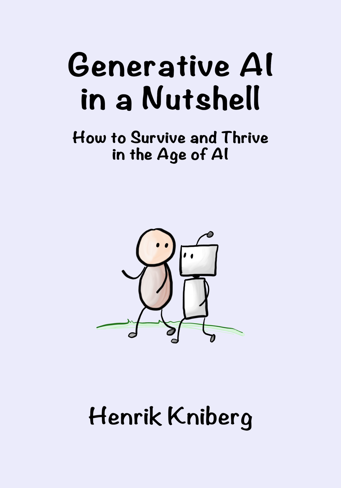

# AI in a Nutshell - Translation guide

This is the source code for the book [Generative AI in a Nutshell - How to Survive and Thrive in the Age of AI](http://ymnig.ai/ainutshell), by Henrik Kniberg. The book is based on the [video with the same title](https://www.youtube.com/watch?v=2IK3DFHRFfw).

This repository is public to enable community-submitted improvements to the AI-translated versions. If you are interested in helping out with this, then I am super grateful!

## Guide for Translators

The book has been AI-translated to 31 languages, all listed at the bottom of this page. Your role as a translator is to **review and improve** these existing translations rather than creating new ones from scratch. Hopefully the AI translations are good enough to provide a good starting point.

The book is distributed on two platforms:

- [LeanPub](https://leanpub.com/ainutshell/) (ebook)
- [Amazon](https://www.amazon.com/Generative-AI-Nutshell-Survive-Thrive-ebook/dp/B0DSBFN12W/) (kindle, paperback in grayscale, hardcover in color). Note that not all translations are available on Amazon.

After improving a translation, it will be immediately published to LeanPub. Amazon updates are a manual process so we update those about once per quarter.

### How to improve a translation

1. **Download the manuscript file and metadata file** for your language. Metadata is stuff like title, subtitle, author info, etc. See the table below for links.
2. **Review it and make improvements** where needed. Also add your name to the "Translator credits" section in the metadata.
3. **Submit** your updated files as a github PR (if you know how to do that), or by emailing the files to ainutshell@ymnig.com.

### Translator guidelines

- **Compare with the English version** when needed, in order to understand the original intent. This is especially important if you are confused about some part of the AI translation.
- **Don't fix what isn't broken**. Only change sentences where the translation is incorrect, or if there is a more suitable way to phrase the sentence. Don't aim for 100% perfection, or you might end up having to rewrite the whole book...
- **Keep to the original style**, tone, and meaning of the sentences. If something is unclear, look at the english version for reference. The english version is on the branch called `publish`.
- **Don't add or remove any content**. If you can't figure out how to phrase something correctly, leave the not-to-good phrasing (or leave it in English) rather than removing the sentence.
- **Make a judgement call for which terminology should be translated**, and which should be left in English. For example terms like "Prompt Engineering" or "Reinforcement Learning".
- **Don't use AI to translate**! The whole point of this is to get human translation to complement the existing AI translations. But you could use AI to bounce ideas.
- **If a sentence or paragraph is hard to direct-translate, feel free to rephrase** it in a way that makes sense in the target language. You can take some liberties here, as long as you stick to the overall intent of the paragraph (and my informal writing style). For example Egbert's sarcastic comments can be tricky to translate directly.
- Some images in the book contain English text. Don't bother trying to translate the images.
- Special tags:
  - `{i: "electricity"}` are used to generate the book index.
  - `{alt: "..."}` are used to generate the alt text for images, which makes the book more accessible to visually impaired readers who use screen readers.
- The metadata file contains some html formatting elements, please leave those.

## Questions or Issues?

If you have any questions or encounter issues during the translation process, please open an issue in this repository or email ainutshell@ymnig.com.

Thank you for contributing to making "Generative AI in a Nutshell" accessible to more readers around the world!

## Translation files and links

Here is a link to each translation.

-  = The translation is already finished and reviewed.
-  = AI translation is done, but human review & improvement is needed

| Language                                                         | Manuscript                                                | Metadata                                            | Amazon link                                                                           | Leanpub link                                      |
| ---------------------------------------------------------------- | --------------------------------------------------------- | --------------------------------------------------- | ------------------------------------------------------------------------------------- | ------------------------------------------------- |
| English              | [manuscript-en.md](manuscript/manuscript-en.md)           | [metadata-en.md](metadata/metadata-en.md)           | [Amazon](https://www.amazon.com/Generative-AI-Nutshell-Survive-Thrive/dp/B0DTK6ZVWX/) | [Leanpub](https://leanpub.com/ainutshell)         |
| Arabic                 | [manuscript-ar.md](manuscript/manuscript-ar.md)           | [metadata-ar.md](metadata/metadata-ar.md)           |                                                                                       | [Leanpub](https://leanpub.com/ainutshell-ar)      |
| Bosnian                | [manuscript-bs.md](manuscript/manuscript-bs.md)           | [metadata-bs.md](metadata/metadata-bs.md)           |                                                                                       | [Leanpub](https://leanpub.com/ainutshell-bs)      |
| Chinese (Simplified)   | [manuscript-zh-Hans.md](manuscript/manuscript-zh-Hans.md) | [metadata-zh-Hans.md](metadata/metadata-zh-Hans.md) |                                                                                       | [Leanpub](https://leanpub.com/ainutshell-zh-Hans) |
| Chinese (Traditional)  | [manuscript-zh-Hant.md](manuscript/manuscript-zh-Hant.md) | [metadata-zh-Hant.md](metadata/metadata-zh-Hant.md) |                                                                                       | [Leanpub](https://leanpub.com/ainutshell-zh-Hant) |
| Czech                  | [manuscript-cs.md](manuscript/manuscript-cs.md)           | [metadata-cs.md](metadata/metadata-cs.md)           |                                                                                       | [Leanpub](https://leanpub.com/ainutshell-cs)      |
| Danish                 | [manuscript-da.md](manuscript/manuscript-da.md)           | [metadata-da.md](metadata/metadata-da.md)           | [Amazon](https://www.amazon.de/dp/B0DWWVP5FM)                                         | [Leanpub](https://leanpub.com/ainutshell-da)      |
| German                 | [manuscript-de.md](manuscript/manuscript-de.md)           | [metadata-de.md](metadata/metadata-de.md)           | [Amazon](https://www.amazon.de/dp/B0DW4G7D6V)                                         | [Leanpub](https://leanpub.com/ainutshell-de)      |
| Greek                  | [manuscript-el.md](manuscript/manuscript-el.md)           | [metadata-el.md](metadata/metadata-el.md)           |                                                                                       | [Leanpub](https://leanpub.com/ainutshell-el)      |
| Spanish                | [manuscript-es.md](manuscript/manuscript-es.md)           | [metadata-es.md](metadata/metadata-es.md)           | [Amazon](https://www.amazon.es/dp/B0DWLL4G7J)                                         | [Leanpub](https://leanpub.com/ainutshell-es)      |
| French                 | [manuscript-fr.md](manuscript/manuscript-fr.md)           | [metadata-fr.md](metadata/metadata-fr.md)           | [Amazon](https://www.amazon.fr/dp/B0DWN1D7LD)                                         | [Leanpub](https://leanpub.com/ainutshell-fr)      |
| Hebrew                 | [manuscript-he.md](manuscript/manuscript-he.md)           | [metadata-he.md](metadata/metadata-he.md)           | [Amazon](https://www.amazon.com/dp/B0DX681CTT)                                        | [Leanpub](https://leanpub.com/ainutshell-he)      |
| Hindi                  | [manuscript-hi.md](manuscript/manuscript-hi.md)           | [metadata-hi.md](metadata/metadata-hi.md)           |                                                                                       | [Leanpub](https://leanpub.com/ainutshell-hi)      |
| Croatian               | [manuscript-hr.md](manuscript/manuscript-hr.md)           | [metadata-hr.md](metadata/metadata-hr.md)           |                                                                                       | [Leanpub](https://leanpub.com/ainutshell-hr)      |
| Hungarian              | [manuscript-hu.md](manuscript/manuscript-hu.md)           | [metadata-hu.md](metadata/metadata-hu.md)           |                                                                                       | [Leanpub](https://leanpub.com/ainutshell-hu)      |
| Indonesian             | [manuscript-id.md](manuscript/manuscript-id.md)           | [metadata-id.md](metadata/metadata-id.md)           |                                                                                       | [Leanpub](https://leanpub.com/ainutshell-id)      |
| Italian                | [manuscript-it.md](manuscript/manuscript-it.md)           | [metadata-it.md](metadata/metadata-it.md)           | [Amazon](https://www.amazon.it/dp/B0DWZZ1WP7)                                         | [Leanpub](https://leanpub.com/ainutshell-it)      |
| Japanese               | [manuscript-ja.md](manuscript/manuscript-ja.md)           | [metadata-ja.md](metadata/metadata-ja.md)           | [Amazon](https://www.amazon.co.jp/dp/B0DX5FZKNX)                                      | [Leanpub](https://leanpub.com/ainutshell-ja)      |
| Korean                 | [manuscript-ko.md](manuscript/manuscript-ko.md)           | [metadata-ko.md](metadata/metadata-ko.md)           |                                                                                       | [Leanpub](https://leanpub.com/ainutshell-ko)      |
| Norwegian Bokmål       | [manuscript-nb.md](manuscript/manuscript-nb.md)           | [metadata-nb.md](metadata/metadata-nb.md)           | [Amazon](https://www.amazon.de/dp/B0DXBG3DMF)                                         | [Leanpub](https://leanpub.com/ainutshell-nb)      |
| Dutch                  | [manuscript-nl.md](manuscript/manuscript-nl.md)           | [metadata-nl.md](metadata/metadata-nl.md)           | [Amazon](https://www.amazon.nl/dp/B0DWXRZH65)                                         | [Leanpub](https://leanpub.com/ainutshell-nl)      |
| Punjabi                | [manuscript-pa.md](manuscript/manuscript-pa.md)           | [metadata-pa.md](metadata/metadata-pa.md)           |                                                                                       | [Leanpub](https://leanpub.com/ainutshell-pa)      |
| Polish                 | [manuscript-pl.md](manuscript/manuscript-pl.md)           | [metadata-pl.md](metadata/metadata-pl.md)           | [Amazon](https://www.amazon.pl/dp/B0DX2B4PVS)                                         | [Leanpub](https://leanpub.com/ainutshell-pl)      |
| Portuguese (Brazil)    | [manuscript-pt-BR.md](manuscript/manuscript-pt-BR.md)     | [metadata-pt-BR.md](metadata/metadata-pt-BR.md)     | [Amazon](https://www.amazon.com/dp/B0DWLMVHZ3)                                        | [Leanpub](https://leanpub.com/ainutshell-pt-BR)   |
| Portuguese (Portugal)  | [manuscript-pt-PT.md](manuscript/manuscript-pt-PT.md)     | [metadata-pt-PT.md](metadata/metadata-pt-PT.md)     | [Amazon](https://www.amazon.es/dp/B0DWLQSS3R)                                         | [Leanpub](https://leanpub.com/ainutshell-pt-PT)   |
| Romanian               | [manuscript-ro.md](manuscript/manuscript-ro.md)           | [metadata-ro.md](metadata/metadata-ro.md)           |                                                                                       | [Leanpub](https://leanpub.com/ainutshell-ro)      |
| Serbian (Latin)        | [manuscript-sr-Latn.md](manuscript/manuscript-sr-Latn.md) | [metadata-sr-Latn.md](metadata/metadata-sr-Latn.md) |                                                                                       | [Leanpub](https://leanpub.com/ainutshell-sr-Latn) |
| Swedish                | [manuscript-sv.md](manuscript/manuscript-sv.md)           | [metadata-sv.md](metadata/metadata-sv.md)           |                                                                                       | [Leanpub](https://leanpub.com/ainutshell-sv)      |
| Thai                   | [manuscript-th.md](manuscript/manuscript-th.md)           | [metadata-th.md](metadata/metadata-th.md)           |                                                                                       | [Leanpub](https://leanpub.com/ainutshell-th)      |
| Turkish                | [manuscript-tr.md](manuscript/manuscript-tr.md)           | [metadata-tr.md](metadata/metadata-tr.md)           |                                                                                       | [Leanpub](https://leanpub.com/ainutshell-tr)      |
| Ukrainian              | [manuscript-uk.md](manuscript/manuscript-uk.md)           | [metadata-uk.md](metadata/metadata-uk.md)           | [Amazon](https://www.amazon.de/dp/B0DX2K51SS)                                         | [Leanpub](https://leanpub.com/ainutshell-uk)      |
| Vietnamese             | [manuscript-vi.md](manuscript/manuscript-vi.md)           | [metadata-vi.md](metadata/metadata-vi.md)           |                                                                                       | [Leanpub](https://leanpub.com/ainutshell-vi)      |
